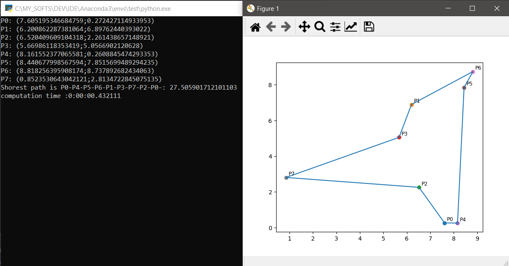

# Python mini projects

#### Tweepy scrapper

##### 	USE CASE:

> From given tweets ID (provided with sentiment analysis):
>
> - Get the text associated to the tweet ID
>
> - Parse tweeter API using tweepy
> - Send requests by batch
> - works from command line with arguments: 
>   - --infile 
>   - --outfile 
>   - --batch_size
>
> outfile can be send to multiclassification program (not finished yet)

#### TSP naïve solver

##### 	USE CASE:

> Deal with a Polygonal Chain:
> 	 Each point has (x,y)
> 	 2 points can make:
>
> 	  - a straight line
> 	  - a line segment: defined length (norm)
>
> **Traveling Salesman Problem:**
> 	what is the shortest path to connect all the points
> 	here bounded TSP: points randomly distributed within a bound Euclidian rectangle.
> 	Naïve solver = O(n!) complexity

