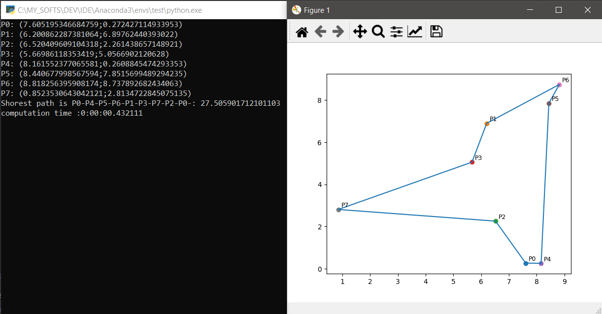

# Python Programming

- Functions / Classes (highly commented code to understand basics of OOP in python)
  - classes, lambda, generators, decorators

- Notebooks:
  - Self assessement
  - Numpy:
    - Intro
    - Numerical operations
    - Broadcasting
    - Vectorization
    - Operations
    - Indexing Slicing
  - Tuples
  - Shallow and Deep copies

- Naive TSP Solver

  **Traveling Salesman Problem:**
  	What is the shortest path to connect all the points?
  	here bounded TSP: points randomly distributed within a bound Euclidian rectangle.
  	Naïve solver = O(n!) complexity

  

- Tweepy scrapper

  Given a list of tweets ID, get the corresponding tweet using tweepy package